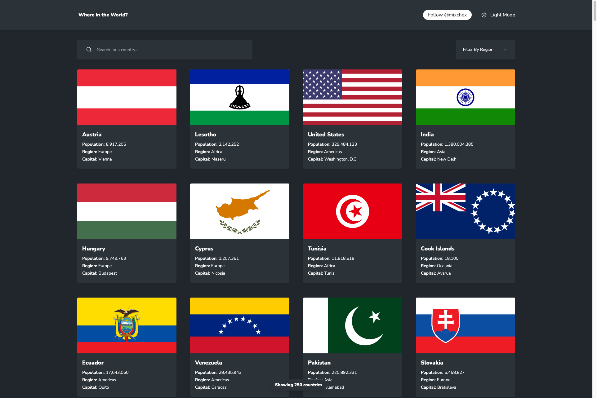

# Frontend Mentor - REST Countries API with color theme switcher solution

This is my (@mixchex) solution to the [REST Countries API with color theme switcher challenge on Frontend Mentor](https://www.frontendmentor.io/challenges/rest-countries-api-with-color-theme-switcher-5cacc469fec04111f7b848ca). Frontend Mentor challenges help you improve your coding skills by building realistic projects. 

## Table of contents

- [Overview](#overview)
  - [The challenge](#the-challenge)
  - [Screenshot](#screenshot)
  - [Links](#links)
- [My process](#my-process)
  - [Built with](#built-with)
  - [What I learned](#what-i-learned)
  - [Continued development](#continued-development)
  - [Useful resources](#useful-resources)
- [Author](#author)
- [Acknowledgments](#acknowledgments)

**Note: Delete this note and update the table of contents based on what sections you keep.**

## Overview
A countries listing microsite with the ability to filter country be your search term or filters. The app also remembers your setting for light or darkmode using the localStorage API.
### The challenge

Users should be able to:

- See all countries from the API on the homepage
- Search for a country using an `input` field
- Filter countries by region
- Click on a country to see more detailed information on a separate page
- Click through to the border countries on the detail page
- Toggle the color scheme between light and dark mode *(optional)*

### Screenshot

### Links

- Solution URL: [https://github.com/mixchex/fementor-rest-countries-api](https://github.com/mixchex/fementor-rest-countries-api)
- Live Site URL: [https://mixchex.github.io/fementor-rest-countries-api/](https://mixchex.github.io/fementor-rest-countries-api/)

## My process

I initally developed the app within the bounds of the designs, but further developed the layout a to make the screens feel a little more integrated and aligned to make for a more cohesive experience.
### Built with

- Semantic HTML5 markup
- Flexbox
- Mobile-first workflow
- [React](https://reactjs.org/) - JS library
- [TypeScript](https://www.typescriptlang.org/) - JavaScript syntax
- [Tailwind CSS](https://tailwindcss.com/) - For styles

### What I learned

I used TypeScript to further develop my skills and came across some tricky situations to account for certain initial states for properties.

It was the first time working with the countries REST API and it seems to have some missing information to make the development of the app, which required an additional local data source to be curated to enable the app to work.

### Continued development

I will definitely be using more TypeScript in future to enhance my skillset.

## Author

- Website - [mikecheshire.com](https://mikecheshire.com)
- Frontend Mentor - [@mixchex](https://www.frontendmentor.io/profile/mixchex)
- Twitter - [@mixchex](https://www.twitter.com/mixchex)

## Acknowledgments

As always, thanks to the teams for React, Typescript and Tailwind CSS for creating awesome resources.